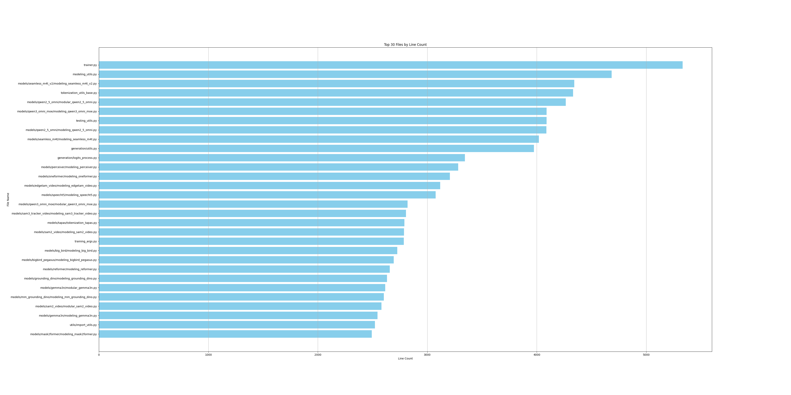
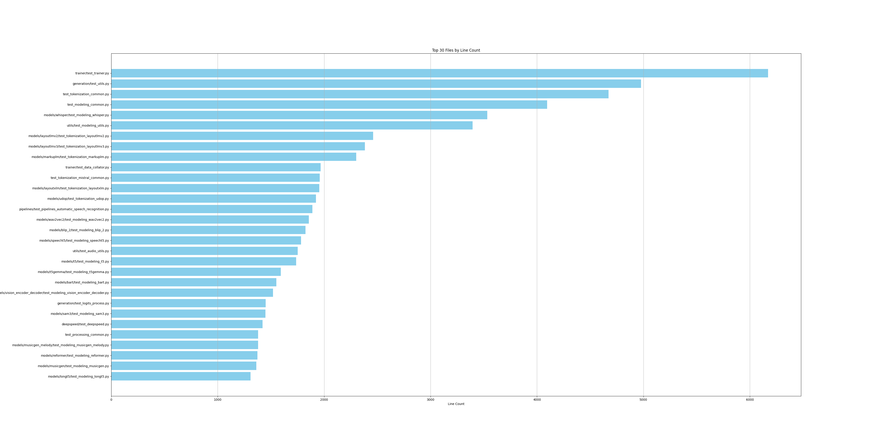
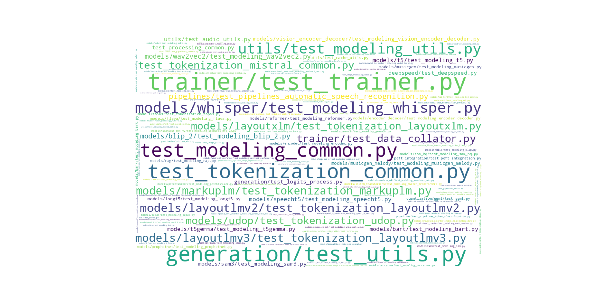

# Task 2: Complexity Analysis
Measuring complexity is useful in many cases, like pinpointing refactoring opportunities, 
and a number of different metrics exist for this task, which are shown in Table 1.
A complexity hotspot is a file that might be problematic due to its high complexity.
With that in mind, complete the following analysis:

## Select two complexity metrics of your choice
Selected metrics are:
- Lines of code (LoC)
- Indentation based complexity (IC)

## Calculate the complexity of all .py files in the repository using the selected metrics

Top 10 files:

| Line Count | File Name |
|-----------|------------|
| 6172 | tests/trainer/test_trainer.py |
| 5333 | src/transformers/trainer.py |
| 4978 | tests/generation/test_utils.py |
| 4683 | src/transformers/modeling_utils.py |
| 4672 | tests/test_tokenization_common.py |
| 4342 | src/transformers/models/seamless_m4t_v2/modeling_seamless_m4t_v2.py |
| 4331 | src/transformers/tokenization_utils_base.py |
| 4265 | src/transformers/models/qwen2_5_omni/modular_qwen2_5_omni.py |
| 4096 | tests/test_modeling_common.py |
| 4090 | src/transformers/models/qwen3_omni_moe/modeling_qwen3_omni_moe.py |

For complete results see: [Lines count table](line_count_table.md)

## Visualize the complexity hotspots. The visualization should effectively convey
Which parts of the code are more complex or change more frequently?  
Feel free
to use any visualization of your choice and explain the rationale behind your
decision.

### For the 'src' module:

### For the 'tests' module:

## What can you say about the correlation between the two complexity measures in this repository? 
For example, if you selected CC and LoC, what can you say for the statement 
“Files with more lines of code tend to have higher cyclomatic complexity”?

TODO

## A colleague of yours claims that “Files with higher complexity tend to be more defective”. What evidence can you present to support or reject this claim for the selected complexity measures in this repository?
TODO