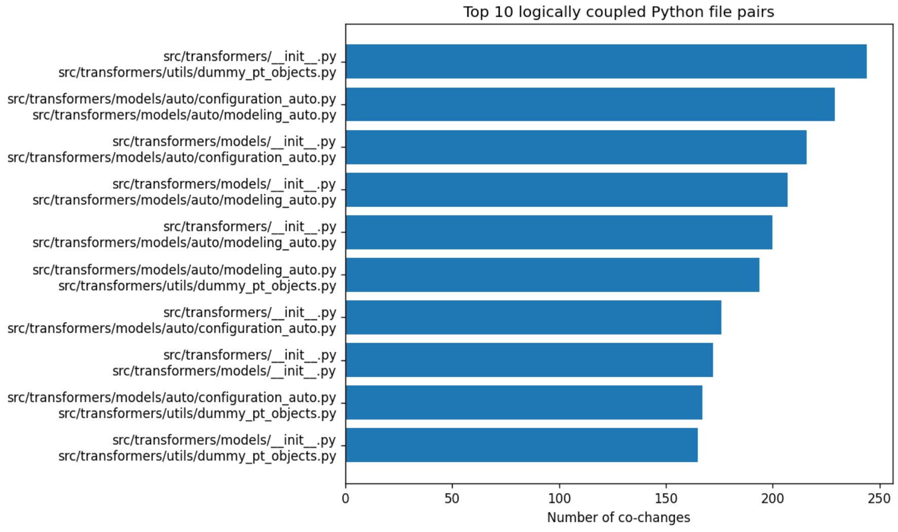

# Task 3: Coupling Analysis

To analyze logical coupling, we first extracted, for every commit, the list of Python files modified together. For each commit, all unique file pairs were generated and each pair received +1 co-change count.

This produced a dictionary of the form: (file_a, file_b) → number of co-changes

We then sorted the pairs by their co-change frequency and visualized the top 10 most coupled pairs using a horizontal bar chart.

The same process was repeated after filtering the pairs so that exactly one file was a test file (starting with “test”) and the other a non-test Python file.

This way, we got the global logical coupling between all Python files, and the logical coupling specifically between production code and its tests.

### Most coupled file pairs (all Python files)

A clear example from the top-10 list is the pair:
- `modeling_auto.py` and `configuration_auto.py`:
These two files are part of the “auto” system in Transformers, which automatically selects the right model and configuration classes based on the user’s input. Because of this, they depend heavily on each other. When a new model is added or an existing one is updated, both files usually need changes. `configuration_auto.py` defines which configuration class should be used, and `modeling_auto.py` links the configuration to the right model implementation. So updating one without touching the other would break the automatic model loading mechanism. Therefore, their high local coupling is expected.

### Coupling between test files and non-test files

This plot shows pairs like:
- `src/transformers/generation/utils.py` <-> `tests/generation/test_utils.py`
- `src/transformers/trainer.py` <-> `tests/trainer/test_trainer.py`
- `src/transformers/modeling_utils.py` <-> `tests/test_modeling_common.py`

These pairings are exactly what we would expect as when a production file changes, its associated test file typically needs updates as well, which leads to strong co-change frequencies.

**Is this coupling a code smell?**
- No, it's not a code smell. Test <-> non-test logical coupling is normal and desirable because it suggests that tests closely follow the implementation, test coverage is maintained, breaking changed trigger tets updates and tests are located in a predictable structure (that is, mirrorin the source tree).

- It would only be a concern if a single test file changed alongside many unrelated modules, as it could indicate overly broad or poorly isolated tests. But the patterns seen in the plot match the expected “one module <-> one test file” relationship.

